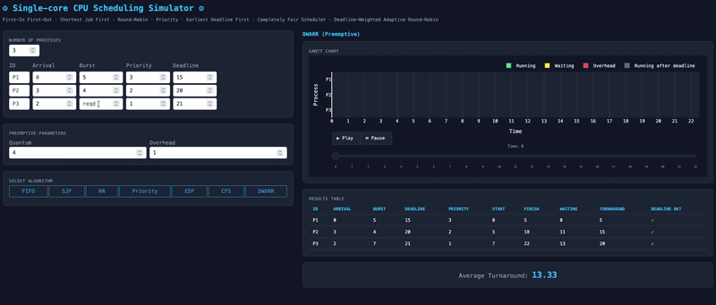

# Simulador de Escalonamento de CPU

[](README.md)

Simulador interativo de escalonamento de CPU construído com Python e Dash, com gráficos de Gantt animados e métricas detalhadas de desempenho para 7 algoritmos de escalonamento: FIFO, SJF, Round-Robin, Priority, EDF, CFS e DWARR (autoral).

[](https://www.python.org/)
[](https://dash.plotly.com/)
[](https://plotly.com/)

---

## :computer: Sobre

Este simulador modela uma CPU executando um conjunto de processos definidos pelo usuário sob sete algoritmos de escalonamento diferentes. O objetivo é tornar visível e numérico como cada algoritmo distribui seu tempo de CPU entre os processos.

<p align="center">
  
</p>

O simulador assume:
- **CPU single-core**: apenas um processo executa por vez
- **Prioridade 1 = mais importante**: quanto menor o número, maior a prioridade
- **Deadlines são absolutos**: referem-se ao instante de tempo até o qual o processo deve terminar, não a um offset relativo

### Como usar

O usuário informa, para cada processo:
- **ID**: identificador do processo (opcional; se omitido, será P1, P2, P3...)
- **Chegada**: instante em que o processo entra na fila de prontos (opcional; se omitido, assume-se 0)
- **Execução**: tempo total de CPU necessário (obrigatório)
- **Prioridade**: obrigatório apenas para Priority e CFS
- **Deadline**: obrigatório apenas para EDF e DWARR

Para algoritmos preemptivos, o usuário informa também:
- **Quantum**: duração máxima de cada fatia de CPU
- **Overhead**: custo de chaveamento de contexto (save + load)

Após preencher os processos, basta clicar no botão do algoritmo desejado:

| Botão | Algoritmo | Tipo |
|---|---|---|
| FIFO | First-In, First-Out | Não preemptivo |
| SJF | Shortest Job First | Não preemptivo |
| RR | Round-Robin | Preemptivo |
| Priority | Escalonamento por Prioridade | Preemptivo |
| EDF | Earliest Deadline First | Preemptivo |
| CFS | Completely Fair Scheduler | Preemptivo |
| DWARR | Deadline-Weighted Adaptive Round-Robin | Preemptivo |

O resultado é exibido imediatamente: o gráfico de Gantt animado e a tabela de métricas aparecem à direita.

### Gráfico de Gantt

O gráfico de Gantt é **animado** e **guiado pelo tempo**. Cada frame corresponde a um tick no eixo de tempo (t = 0, 1, 2, ..., tempo total). Enquanto a animação é reproduzida, as barras crescem da esquerda para a direita, mostrando exatamente como o escalonador preenche cada unidade de tempo — todas as barras avançam simultaneamente.

| Cor | Significado |
|---|---|
| :green_square: Verde | Processo em execução (dentro do deadline) |
| :yellow_square: Amarelo | Processo aguardando (chegou mas não está na CPU) |
| :red_square: Vermelho | Sobrecarga de chaveamento (exibida apenas na linha do processo interrompido) |
| :white_large_square: Cinza | Processo executando após o deadline ter passado |

Controles disponíveis:
- **▶ Play**: reproduz a animação desde o início (t = 0)
- **⏸ Pause**: congela a animação no frame atual
- **Slider**: arraste para qualquer instante de tempo manualmente

### Métricas

| Coluna | Descrição |
|---|---|
| **Arrival** | Instante em que o processo chega |
| **Burst** | Tempo total de CPU necessário pelo processo |
| **Deadline** | Instante até o qual o processo deve terminar (quando aplicável) |
| **Priority** | Valor de prioridade (quando aplicável) |
| **Start** | Primeiro instante em que o processo efetivamente executou na CPU |
| **Finish** | Último instante em que o processo terminou de executar |
| **Waiting** | `Turnaround − Execução`: tempo gasto sem executar seu próprio burst |
| **Turnaround** | `Término − Chegada`: tempo total desde a chegada até a conclusão |
| **Deadline OK?** | ✓ se terminou antes ou no deadline, ✗ caso contrário |

Abaixo da tabela, o **Average Turnaround** é exibido — a média do turnaround de todos os processos, a principal métrica de comparação entre algoritmos.

> **Nota sobre o tempo de espera:** inclui tanto a espera ociosa (CPU ocupada com outros processos) quanto os períodos de sobrecarga de chaveamento do próprio processo. Representa todo o tempo que o processo esteve ativo mas sem executar seu próprio burst.

---

## :hammer_and_wrench: Tecnologias utilizadas

- **[Python 3.10+](https://www.python.org/)**: linguagem principal
- **[Dash 2.x](https://dash.plotly.com/)**: framework para aplicação web interativa
- **[Plotly 5.x](https://plotly.com/python/)**: gráficos de Gantt animados e interativos
- **[Dash Bootstrap Components](https://dash-bootstrap-components.opensource.faculty.ai/)**: layout e estilização da interface

---

## :rocket: Como executar o projeto

### Pré-requisitos

- Python 3.10 ou superior
- pip

### Instalação

```bash
# 1. Clone o repositório
git clone https://github.com/GabrielReira/cpu-scheduling-simulator.git
cd cpu-scheduling-simulator

# 2. Crie e ative um ambiente virtual
python -m venv venv

# No Windows:
venv\Scripts\activate

# No macOS/Linux:
source venv/bin/activate

# 3. Instale as dependências
pip install -r requirements.txt

# 4. Execute a aplicação
python app.py
```

Depois abra o navegador em `http://127.0.0.1:8050`.

### Estrutura do projeto

```
cpu-scheduling-simulator/
├── app.py                   # Aplicação Dash, layout e callbacks
├── requirements.txt
└── utils/
    ├── algorithms.py        # Implementação dos 7 algoritmos de escalonamento
    ├── metrics_and_gantt.py # Cálculo de métricas e gráfico de Gantt animado
    └── style.py             # Paleta de cores e constantes de estilo da interface
```

---

## :gear: Algoritmos

O simulador implementa sete algoritmos que podem ser divididos em duas categorias: não preemptivos e preemptivos.

### Não preemptivos

#### FIFO: First-In First-Out
A política mais simples. Os processos são executados em ordem de chegada. Uma vez iniciado, o processo roda até o fim sem interrupção.

#### SJF: Shortest Job First
A cada ponto de decisão de escalonamento, o algoritmo seleciona o processo pronto com o menor tempo de execução. Em caso de empate, vence o que chegou primeiro. Como o FIFO, é não-preemptivo: o processo escolhido roda até o fim.

### Preemptivos

Todos os algoritmos preemptivos utilizam os parâmetros **Quantum** e **Sobrecarga (overhead)**. A regra de sobrecarga é descrita na seção [Regras de Escalonamento](#regras-de-escalonamento).

#### RR: Round-Robin
Os processos se revezam na CPU em ordem de chegada. Cada processo ocupa a CPU por no máximo um quantum de tempo. Se não terminar, é reinserido no fim da fila e o próximo processo assume. Utiliza quantum fixo.

#### Priority: Escalonamento por Prioridade
A cada quantum, o processo mais importante (menor número de prioridade) é selecionado. Se o mesmo processo continua sendo o mais importante após seu quantum, ele prossegue sem sobrecarga.

#### EDF: Earliest Deadline First
A cada quantum, o processo pronto com o menor deadline absoluto é selecionado. Assim como no escalonamento por prioridade, a sobrecarga só é cobrada quando o processo em execução muda.

#### CFS: Completely Fair Scheduler _(simplificado)_
Inspirado no escalonador CFS do kernel Linux. Cada processo mantém um **tempo virtual** (`vruntime`) que se acumula proporcionalmente ao tempo real executado e ao peso de prioridade:

```
vruntime += Δt × w(prioridade)
w(prioridade) = 1,25 ^ (prioridade − 1)
```

A cada passo, o processo com o **menor vruntime** assume a CPU. Na chegada, o vruntime de um processo é iniciado com o tempo atual (entrada justa). O tamanho da fatia de tempo é calculado como o tempo necessário para o vruntime do processo atual alcançar o do próximo processo — sem quantum fixo. Um número de prioridade menor significa peso menor, ou seja, o vruntime cresce mais devagar, o que resulta em mais tempo de CPU.

A sobrecarga só ocorre quando o processo em execução muda.

#### DWARR: Deadline-Weighted Adaptive Round-Robin _(algoritmo autoral)_
Algoritmo autoral criado para este simulador. Combina a urgência do EDF com a justiça do Round-Robin e um quantum dinâmico. Três regras governam cada decisão de escalonamento:

1. **Banda de urgência**: Encontra o processo mais urgente na fila (menor deadline). Seu burst restante define uma janela `W`. Todos os processos cujo deadline está dentro de `W` do deadline mais urgente formam a **banda de urgência** e são considerados igualmente urgentes:
   ```
   band = { process : process.deadline − earliest.deadline ≤ W }
   ```
   Processos fora da banda aguardam (ainda não são críticos no tempo).

2. **Seleção**: Dentro da banda, seleciona o processo menos despachado recentemente (rotação round-robin via contador de despachos). Isso impede que algum processo monopolize a CPU quando vários são igualmente urgentes.

3. **Quantum dinâmico**: Calculado como o gap de deadline para o competidor mais próximo dentro da banda:
   ```
   quantum = min(burst_restante, gap_de_deadline_mais_próximo)
   ```
   | Situação | Gap | Quantum |
   |---|---|---|
   | Sozinho na banda | — | `restante` (executa até o fim) |
   | Deadlines iguais | 0 | 1 (Round-Robin) |
   | Deadlines com 1 de diferença | 1 | 1 (intercalação fina) |
   | Deadlines com 3 de diferença | 3 | 3 (fatias médias) |
   | Deadlines com 4 de diferença, burst 4 | 4 | 4 (executa até o fim) |

A janela `W` encolhe conforme o processo mais urgente executa, de modo que a banda vai naturalmente se estreitando ao longo do tempo, dando prioridade crescente a quem está mais próximo do seu deadline. A sobrecarga (overhead) só acontece quando há troca de processo.

---

## :bar_chart: Exemplos de execução

### Exemplo 1

| ID | Chegada | Execução | Prioridade | Deadline |
|---|---|---|---|---|
| P1 | 0 | 5 | 3 | 15 |
| P2 | 3 | 4 | 2 | 20 |
| P3 | 2 | 7 | 1 | 21 |

Parâmetros: **Quantum = 2**, **Overhead = 1**

| Algoritmo | Turnaround Médio |
|---|---|
| FIFO | 9,33 |
| SJF | 8,33 |
| RR | 17,33 |
| Priority | 16,00 |
| EDF | 12,00 |
| CFS | 22,67 |
| DWARR | 13,33 |

### Exemplo 2

| ID | Chegada | Execução | Prioridade | Deadline |
|---|---|---|---|---|
| A | 0 | 14 | 4 | 28 |
| B | 0 | 4 | 1 | 6 |
| C | 0 | 2 | 3 | 8 |
| D | 0 | 6 | 5 | 13 |
| E | 0 | 8 | 2 | 37 |

Parâmetros: **Quantum = 4**, **Overhead = 1**

| Algoritmo | Turnaround Médio |
|---|---|
| FIFO | 22,40 |
| SJF | 14,80 |
| RR | 23,80 |
| Priority | 20,60 |
| EDF | 18,40 |
| CFS | 37,80 |
| DWARR | 17,40 |

### Exemplo 3

| ID | Chegada | Execução | Prioridade | Deadline |
|---|---|---|---|---|
| A | 0 | 4 | 1 | 7 |
| B | 2 | 2 | 2 | 5 |
| C | 4 | 1 | 3 | 8 |
| D | 6 | 3 | 4 | 10 |

Parâmetros: **Quantum = 2**, **Overhead = 1**

| Algoritmo | Turnaround Médio |
|---|---|
| FIFO | 3,75 |
| SJF | 3,50 |
| RR | 5,00 |
| EDF | 5,00 |
| CFS | 6,00 |
| DWARR | 4,50 |

---

## :clipboard: Regras de escalonamento

Estas regras se aplicam a todos os algoritmos preemptivos.

### Sobrecarga de chaveamento (context-switch overhead)
A sobrecarga de chaveamento (custo de salvar e restaurar o estado da CPU) é modelada como uma operação de **save + load**. Regras:

- **Sem sobrecarga quando um processo termina naturalmente:** um processo que conclui seu burst não tem nada a salvar. O próximo processo é simplesmente carregado (apenas um *load*, não um *save+load*)
- **Sobrecarga é cobrada quando um processo em execução é interrompido:** quando um processo ainda tem burst restante e um processo diferente assume a CPU, há sobrecarga. Isso representa um save+load completo
> - **Exceção no Round-Robin:** a sobrecarga é cobrada sempre que um processo é interrompido, independentemente de o próximo ser o mesmo processo ou um diferente. Isso reflete o fato de que o processo interrompido é reinserido na fila e seu estado precisa ser salvo e recarregado na sua próxima vez

### Preempção
A preempção ocorre nos limites de quantum ou na chegada de um novo processo. Após qualquer um desses eventos, o escalonador reavalia a fila de prontos e pode trocar de processo.

### Ordem na fila durante a sobrecarga
Se um novo processo chega durante o período de sobrecarga, ele é enfileirado **antes** de o processo interrompido ser reinserido na fila. Isso significa que processos recém-chegados rodam antes do processo que acabou de ser interrompido.

---

## :scroll: Licença
Esse projeto está sob a licença MIT. Veja o arquivo [LICENSE](LICENSE) para mais detalhes.

---

<p align="center"><strong>Por <a href="https://www.linkedin.com/in/gabrielreira/">Gabriel</a></strong></p>
